# zx-kit

> **A Speccy-flavoured fantasy toolkit for tiny TypeScript browser games**.Inspired by the ZX Spectrum — not an emulator, not a hardware clone.

Spectrum-palette canvas rendering. ROM bitmap font. AY-3-8912 three-channel audio. Beeper SFX. Opt-in stereo panning. Tile maps. Free-roaming sprites. Collision detection. Saves. Camera. Scene manager. Particle pool. Dithered lighting. Offscreen layer cache. Authentic attribute clash. Monochrome playfield. Zero dependencies. TypeScript-first.


---

## Built with zx-kit

Three games, one engine. Every frame below is an **unedited capture of the running game**, taken straight off its canvas — no mock-ups, no touch-ups.

<table style="min-width: 300px;">
<colgroup><col style="min-width: 100px;"><col style="min-width: 100px;"><col style="min-width: 100px;"></colgroup><tbody><tr><th colspan="1" rowspan="1"><p><a target="_blank" rel="noopener noreferrer nofollow" href="https://github.com/zrebec/minefield">Minefield</a><br>mines + audio navigation, playable without sight</p></th><th colspan="1" rowspan="1"><p><a target="_blank" rel="noopener noreferrer nofollow" href="https://github.com/zrebec/chaosbunny">chaosBunny</a><br>vertical cave climber — the kit's own dogfood</p></th><th colspan="1" rowspan="1"><p><a target="_blank" rel="noopener noreferrer nofollow" href="https://github.com/zrebec/icehaul">IceHaul</a><br>a 20-tonne load on ice, stall-and-redline manual</p></th></tr><tr><td colspan="1" rowspan="1">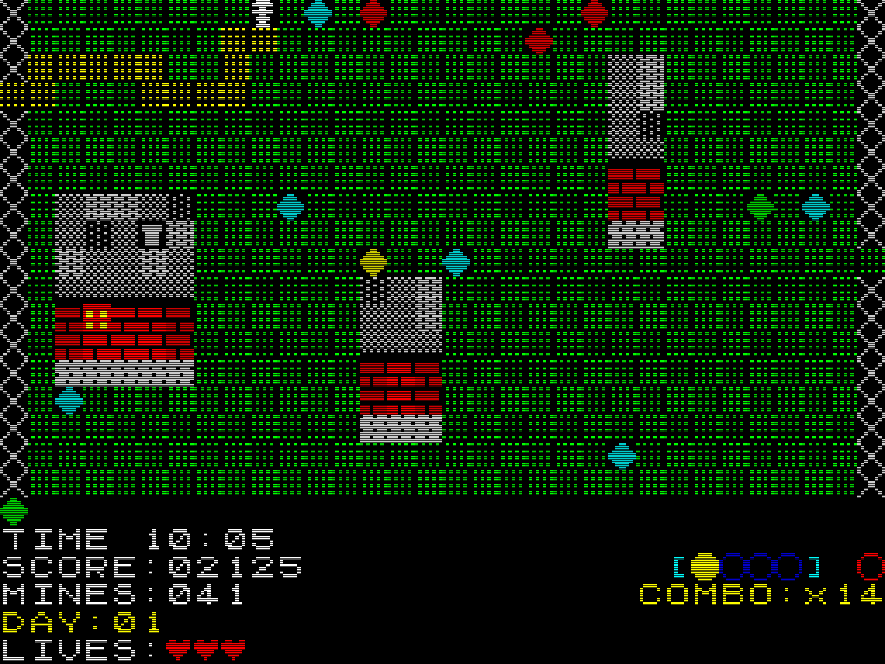<p><br>Tile map, dithered ground, 8×8 cell HUD</p></td><td colspan="1" rowspan="1">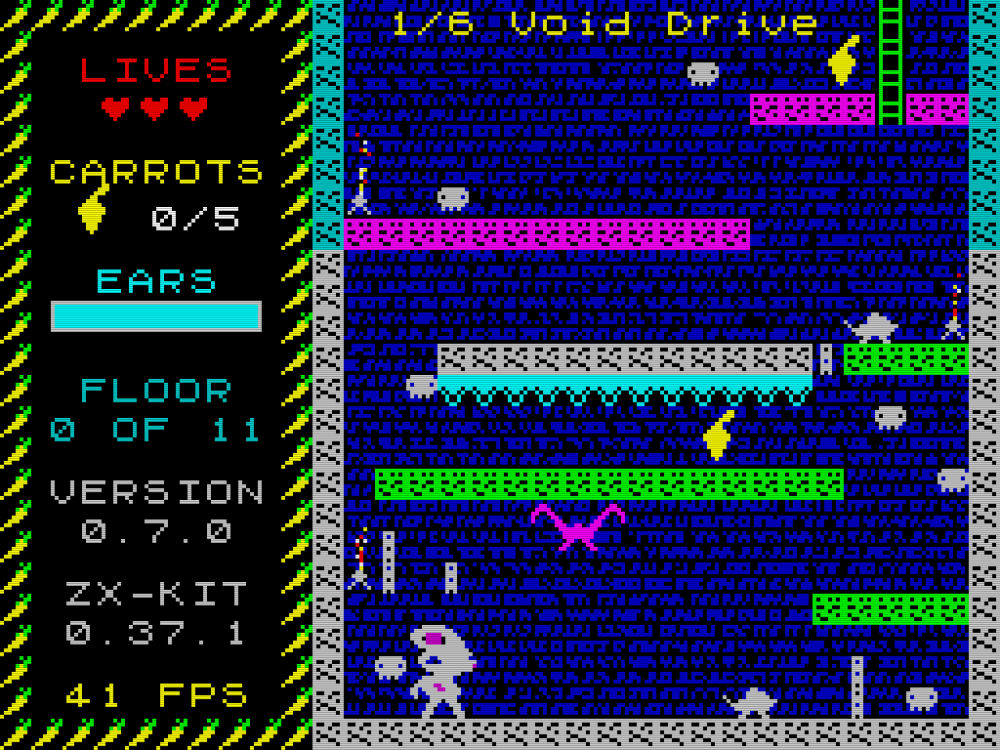<p><br>Full colour: sprites keep their own inks</p></td><td colspan="1" rowspan="1">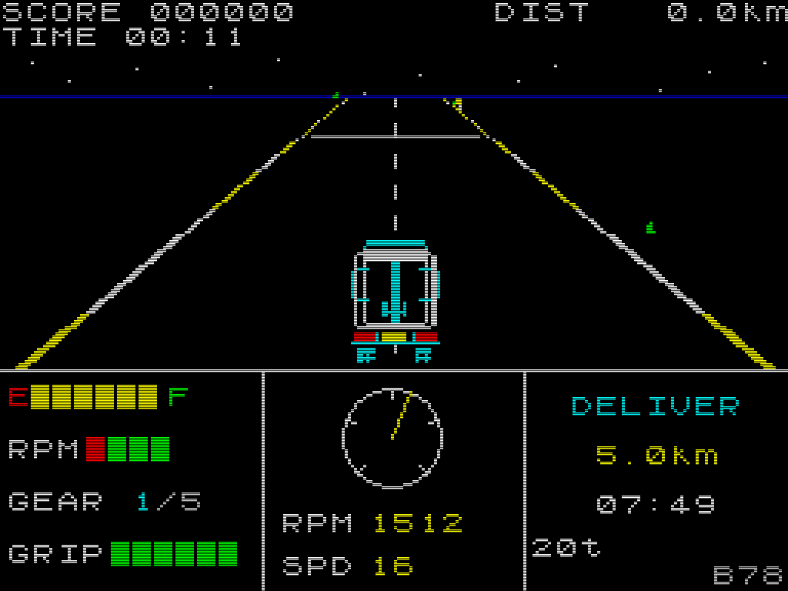<p><br>Pseudo-3D road, ROM font instrument panel</p></td></tr><tr><td colspan="1" rowspan="1">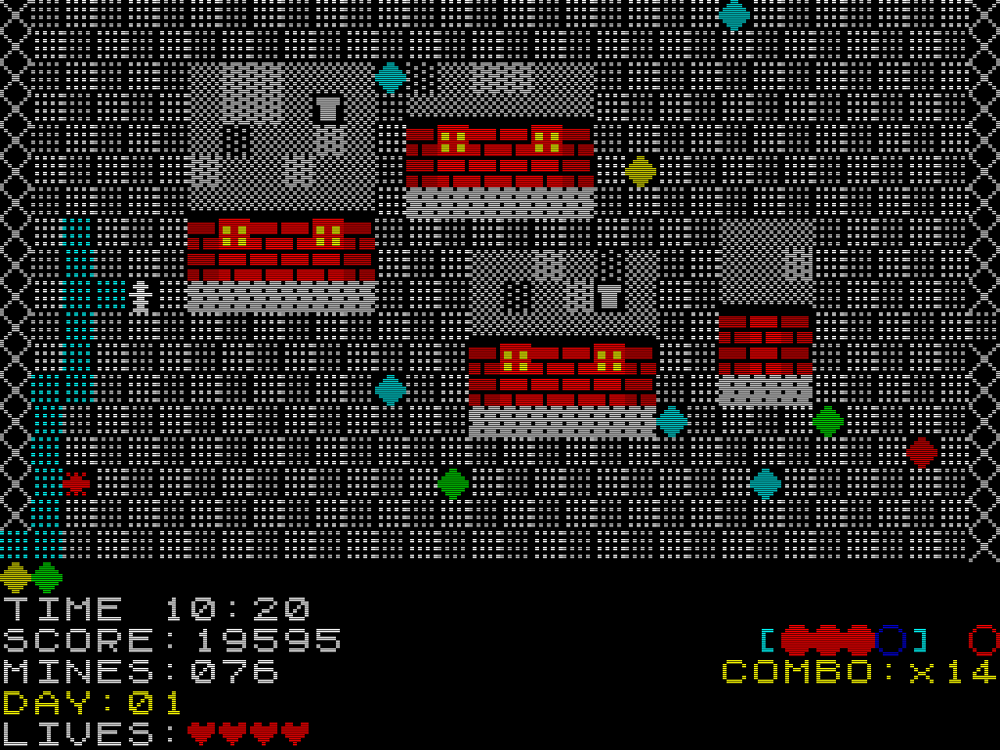<p><br>Same engine, a second surface palette</p></td><td colspan="1" rowspan="1">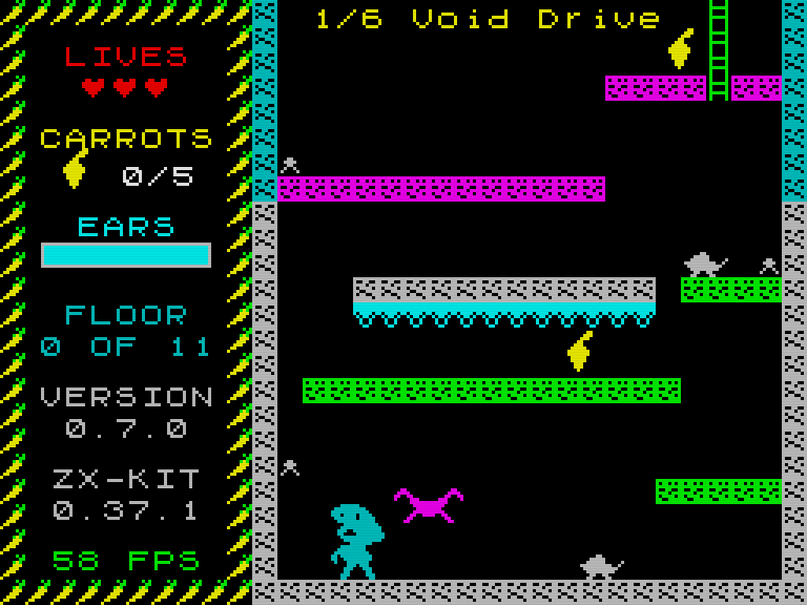<p><br><strong>Authentic attribute clash</strong> — one ink per 8×8 cell</p></td><td colspan="1" rowspan="1">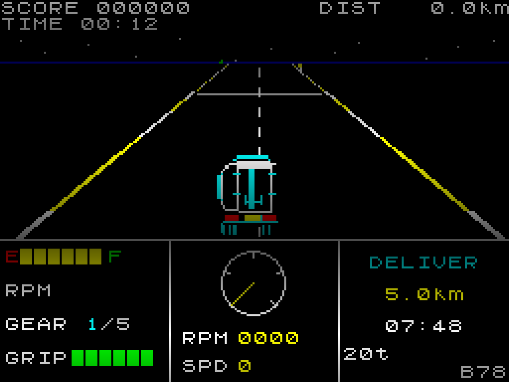<p><br>Braking into a slide — grip as a readable gauge</p></td></tr><tr><td colspan="1" rowspan="1">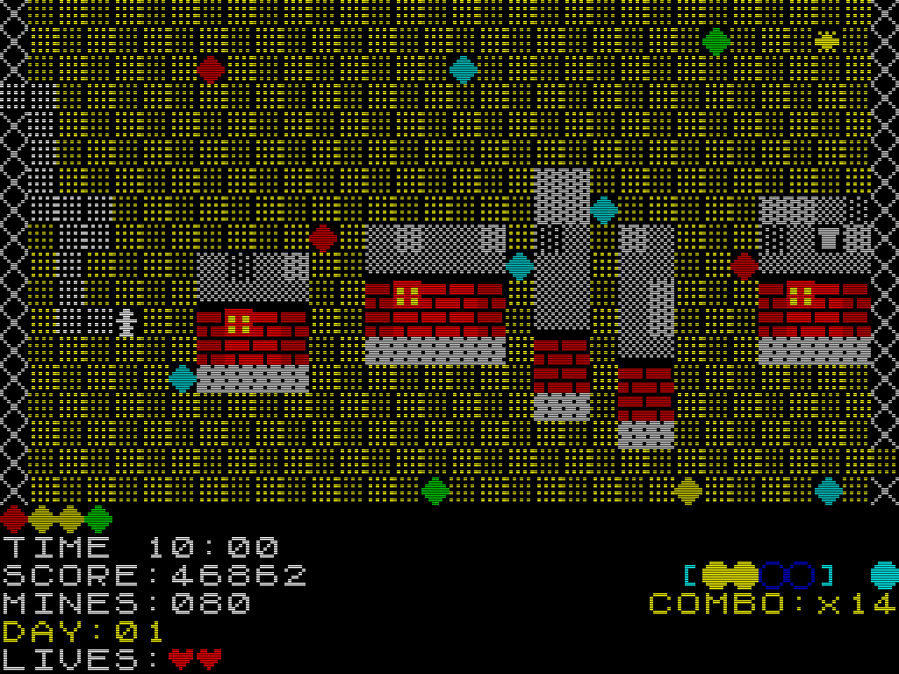<p><br>Late level: two extra mine types in play</p></td><td colspan="1" rowspan="1">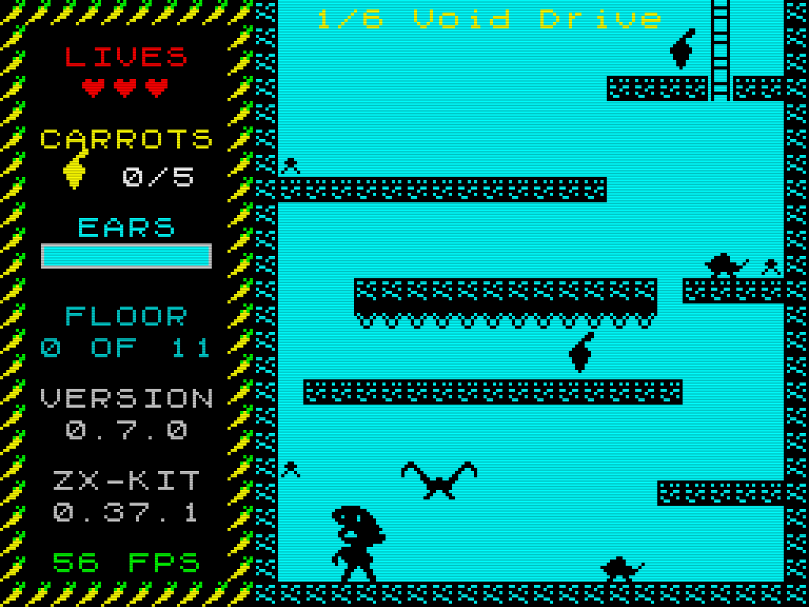<p><br><strong>Monochrome playfield</strong> — clash-proof, colour HUD kept</p></td><td colspan="1" rowspan="1">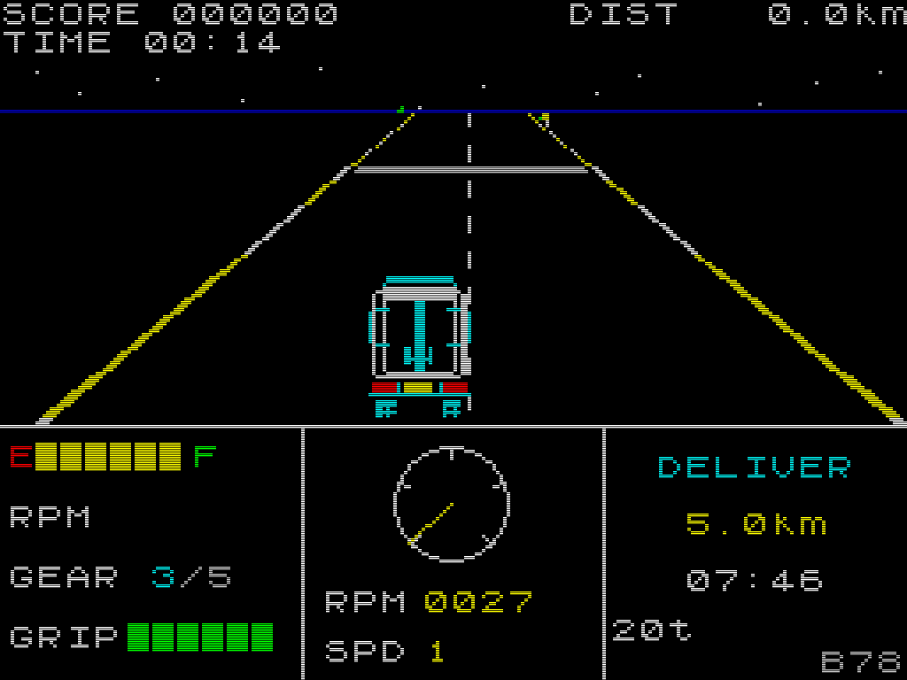<p><br>Stalled under load — the mechanic, not a bug</p></td></tr><tr><td colspan="1" rowspan="1">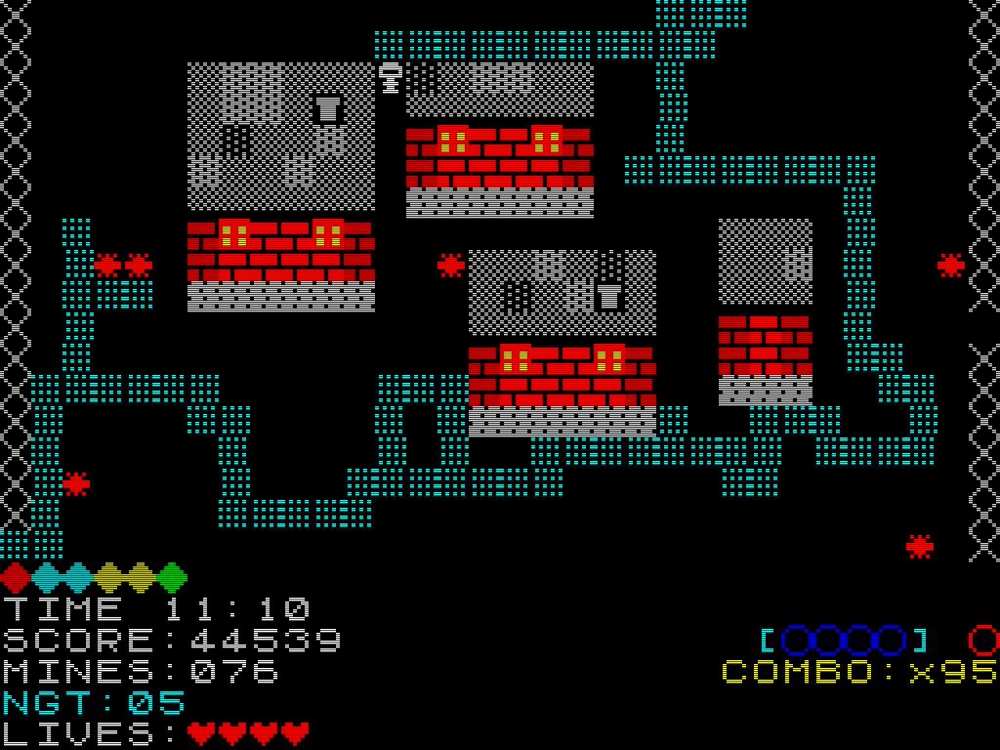<p><br>Nightfall, full clear, mines revealed by gem rewards</p></td><td colspan="1" rowspan="1">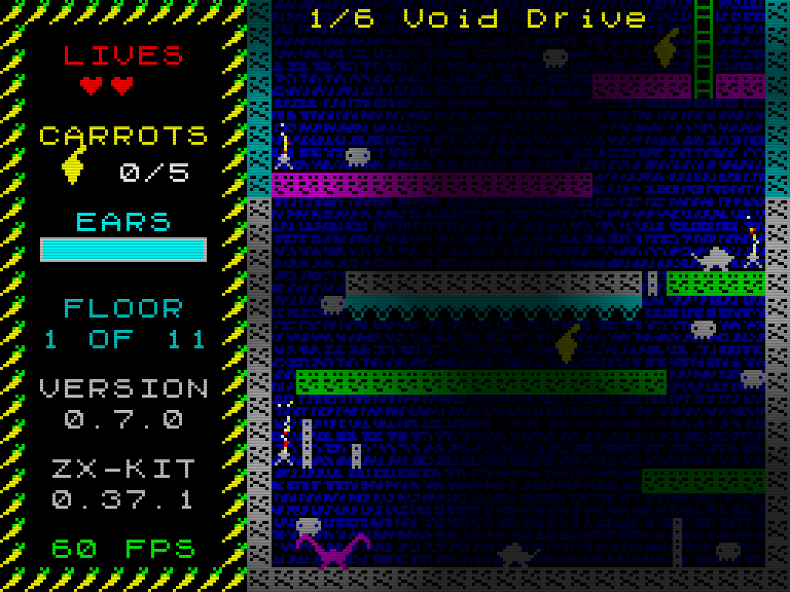<p><br><strong>Dithered lighting</strong> — torches and moonlight only</p></td><td colspan="1" rowspan="1">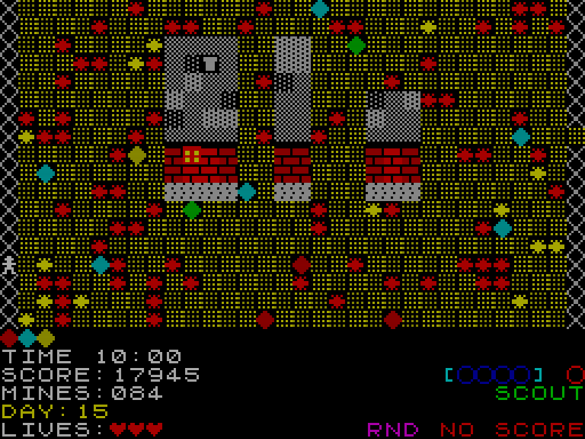<p><br>Minefield, every mine revealed — practice run</p></td></tr></tbody>
</table>

Play them in a browser: [**Minefield**](https://zrebec.github.io/minefield/) · [**IceHaul**](https://zrebec.github.io/icehaul/)

---

## Why zx-kit?

The ZX Spectrum was a marvel of constraint: its 8×8 pixel grid, 15-color palette, and 1-bit beeper defined an entire visual and sonic language. Thousands of games were made with nearly nothing — and they were unforgettable.

zx-kit captures that aesthetic in TypeScript. You get the Spectrum's palette, ROM font, 8×8 cell thinking, beeper sounds, and AY-style chiptune audio — but without the hardware prison. Sprites keep their own colors. Lighting is smooth. Saves work. Mouse and gamepad are supported. The 256×192 canvas is a soft constraint, not a law.

**Think of it as a tiny fantasy console in the spirit of the ZX Spectrum** — not an emulator, not a hardware clone, but a tool that lets that aesthetic live in modern TypeScript games.

---

## Key Features

- **AY-3-8912 Melodik emulator** — three independent square-wave channels, LFSR noise generator, all 16 hardware envelope shapes, logarithmic amplitude table accurate to the real chip
- **Stereo panning (opt-in, non-breaking)** — per-channel pan on the AY (`pan(ch)` plus `mono`/`abc`/`acb` presets) and independent per-channel volume fades, plus a `pan` argument on the beeper (`beep`/`playPattern`). Default is centred/mono, so existing audio is byte-identical — a modern "under glass" affordance (e.g. directional cues for accessibility)
- **ZX Spectrum ROM font** — all 96 printable ASCII characters, 8×8 pixels, byte-for-byte faithful to the original ROM
- **Authentic 15-color palette** — normal and bright variants, palette-enforced at compile time via the `SpectrumColor` type
- **Canvas renderer** — pixel-perfect scaled rendering, sprite flipping, text drawing, CRT scanline overlay, dither/shade tones, animated border flashing
- **Tile map engine** — scrollable maps, O(1) id-index, smart seasonal background swapping, solid-tile collision queries
- **Offscreen layer cache** — render a static or rarely-changing layer (tile map, CRT overlay) once to an offscreen canvas and blit it each frame; `dirty`-flag invalidation turns thousands of per-pixel `fillRect`s into a single `drawImage`
- **Authentic attribute clash (opt-in)** — a 32×24 cell ink/paper screen that reproduces the real Spectrum colour bleed when a sprite and the background share an 8×8 cell; resolved to one `putImageData`/frame. Off by default, on when you want it
- **Monochrome playfield (opt-in)** — the classic anti-clash trick: render the action area in a single ink + paper at its own size, keep the colour in the HUD around it. Everything inside becomes a clean two-colour silhouette — no clash, ever
- **Free-roaming sprites** — position, velocity, gravity, `flipX` caching, transparent or opaque background
- **Three-tier collision** — AABB overlap tests, generic rect-vs-tile wall resolution (any sprite size), and pixel-precise mask overlap with O(pixels) sorted-merge intersection — no allocations per frame
- **Keyboard and gamepad input** — configurable key-repeat, transparent gamepad polling, single-consume action flags, instant state reset on phase transitions, built-in `+`/`-` volume with an auto-hide HUD bar (one render-loop line)
- **ZX-style UI widgets** — progress bars with managed lifetime, boxes, frames, panel titles
- **Typed save / load** — persistent saves via `localStorage` with schema versioning, migrations, slot enumeration, in-memory throttling, and discriminated Result types for every failure mode
- **Runtime locale switching** — type-safe string-pack selection via `pickLocale()`, so a game can switch language while running — unimaginable on the original Spectrum, natural in the browser
- **Zero dependencies** — only Web platform APIs: `Canvas`, `Web Audio`, `KeyboardEvent`, `Gamepad`
- **Tree-shakeable** — `sideEffects: false`, so unused modules are dropped from your production bundle
- **TypeScript-first** — strict mode, full `.d.ts` declarations, no `any`

---

## Spectrum-inspired, not hardware-accurate by default

zx-kit is not a ZX Spectrum emulator, and the **default** renderer does not model the hardware attribute clash (where every 8×8 cell can hold only one ink/paper pair), the ULA timing, or the Z80 memory layout. The default path composites in full colour, so sprites keep their own colours and never bleed into the background.

What it does model is the **aesthetic discipline** of the Spectrum:

- 256×192 canvas (soft constraint — you can go larger)
- 15-color palette, compile-time enforced via `SpectrumColor`
- 8×8 cell rhythm for tiles, sprites, and UI
- ROM-accurate font (byte-for-byte from the original ROM)
- Monochromatic bitmap sprites
- Beeper-style 1-bit SFX
- AY-3-8912-style three-channel chiptune audio

**Want the real thing?** Three opt-in rendering paths cover the spectrum from fantasy to faithful:

| Path | Module | Look |
| --- | --- | --- |
| **Fantasy** (default) | `renderer` | Full-colour compositing — sprites keep their colours, no bleed. Best for readability. |
| **Authentic clash** | `attrscreen` | 1-bit pixels + a 32×24 ink/paper grid: real per-cell colour bleed when a sprite and the background share an 8×8 cell. |
| **Anti-clash** | `monoscreen` | One ink/paper for the whole playfield — clash-proof monochrome action, with a colourful HUD around it. |

A white hero walking past a green plant stays white under the **default** renderer, bleeds the shared cell under `attrscreen`, and is a clean silhouette under `monoscreen` — your choice, per game or per in-game toggle.

---

## Installation

### From npm (recommended)

```bash
npm install zx-kit
```

Then import directly — no Vite alias, no path mapping, no bundler configuration required:

```ts
import { setupCanvas, C, CELL, initAudio, playAY, initInput } from 'zx-kit'
```

The package ships compiled JavaScript (`dist/`) with full TypeScript declarations.

### From source (local / offline development)

Clone the repository and link it into your project:

```bash
# 1. Clone and build zx-kit
git clone https://github.com/zrebec/zx-kit.git
cd zx-kit
npm install
npm run build

# 2. In your game project — install from local path
npm install ../zx-kit
```

> Use `npm install ../zx-kit --prefer-online` if npm caches the local path aggressively. Switch back to the npm version any time: `npm install zx-kit@latest`

---

## Quick Start

A game loop in under 30 lines:

```ts
import {
  setupCanvas, C, CELL,
  drawText, drawSprite,
  initAudio, createAY,
  initInput, tickMovement,
} from 'zx-kit'

const canvas = document.getElementById('game') as HTMLCanvasElement
const ctx = setupCanvas(canvas, 4)  // 256×192 game px → 1024×768 CSS px

initInput()

// Audio must start inside a user gesture (browser policy)
let ay: ReturnType<typeof createAY> | null = null
window.addEventListener('keydown', () => {
  initAudio()
  ay = createAY()
  ay.tone('A', 440, 10)  // start a tone on channel A
}, { once: true })

const PLAYER = new Uint8Array([0x18, 0x3C, 0x7E, 0xFF, 0xFF, 0x7E, 0x24, 0x66])
let px = 120, py = 88

let last = performance.now()
function loop(now: number) {
  const dt = now - last; last = now

  const dir = tickMovement(dt)
  if (dir === 'left')  px -= 1
  if (dir === 'right') px += 1
  if (dir === 'up')    py -= 1
  if (dir === 'down')  py += 1

  ctx.fillStyle = C.BLACK
  ctx.fillRect(0, 0, 256, 192)
  drawText(ctx, 'ZX-KIT', 0, 0, C.B_GREEN, C.BLACK)
  drawSprite(ctx, PLAYER, px, py, C.B_CYAN, C.BLACK)

  requestAnimationFrame(loop)
}
requestAnimationFrame(loop)
```

---

## Documentation

| Guide | What's inside |
| --- | --- |
| Getting started | Project setup + a complete first game, start to finish. |
| Rendering | Canvas, sprites, bitmaps, attr/mono screens, cache, scrolling, lighting, palette, font. |
| Audio | Beeper vs AY, the AY-3-8912 emulator, note-name music. |
| Collision | AABB, rect-vs-tile, pixel-precise — when and how. |
| Save / load | Typed `localStorage` saves with versioning and migration. |
| API reference | Input, sprites, animation, camera, scenes, tilemap, UI, particles, RNG, i18n, presentation, debug. |
| Examples | Runnable snippets + the flagship games. |
| API stability | What's Stable vs Experimental, the deprecation policy, and the road to 1.0. |

Background: retrospective · debug / telemetry analysis.

## Modules

Everything is re-exported from the package root — `import { setupCanvas, createAY, /* ... */ } from 'zx-kit'`. Zero runtime dependencies, `sideEffects: false`, fully tree-shakeable.

| Module | Summary | Guide |
| --- | --- | --- |
| `palette` | `SCALE`, `CELL`, the 15-colour `C` object, `SpectrumColor` type | rendering |
| `font` | 96-char ROM 8×8 bitmap font, `getCharRow` | rendering |
| `renderer` | Canvas setup, sprites, text, bitmaps, attribute maps, scanlines, dither/shade, border flash | rendering |
| `cache` | Offscreen layer cache with dirty-flag invalidation | rendering |
| `attrscreen` | Opt-in authentic per-cell ink/paper colour clash | rendering |
| `monoscreen` | Opt-in monochrome playfield + colour HUD (clash-proof) | rendering |
| `tilescroll` | Pixel-smooth sub-tile tilemap scrolling | rendering |
| `lighting` | Dithered cave darkness, one blit per frame | rendering |
| `audio` | 1-bit beeper: square-wave notes, patterns, instant cut, stereo pan, volume + built-in auto-hide volume bar | audio |
| `ay` | AY-3-8912: 3-channel tone, LFSR noise, 16 envelopes, per-channel stereo pan + volume | audio |
| `aydump` | Real ZX-scene tunes: PSG register-dump player, sample-accurate AudioWorklet chip emulator | audio |
| `music` | AY music by note name (`A5`, `C#4`) + looping | audio |
| `collision` | AABB / rect-vs-tile / pixel-precise mask overlap | collision |
| `save` | Typed save/load: versioning, migration, slots, throttle, optional tamper signature | save |
| `hiscore` | High-score table over the save envelope: top-N insert, per-game `Extra` fields, tamper deterrence | save |
| `input` | Keyboard + gamepad movement, key-repeat, action flags, built-in `+`/`-` volume keys | api |
| `sprite` | Free-roaming sprites: position, velocity, gravity, flip | api |
| `animation` | Frame timer, position tween, blinker | api |
| `camera` | Viewport follow with lerp + deadzone, world clamp | api |
| `scene` | Stack-based scene manager with lifecycle hooks | api |
| `tilemap` | Scrollable maps, solid tiles, O(1) id-index, bg swap | api |
| `ui` | Boxes, frames, panel titles, progress bars, gauges | api |
| `particles` | Allocation-free particle pool for pixel effects | api |
| `rng` | Seeded mulberry32 PRNG (int/range/float/pick/shuffle/fork) | api |
| `i18n` | Type-safe runtime locale selection | api |
| `presentation` | Title/loading helpers: blink, tape stripes, menus | api |
| `debug` | Frame-timing monitor + FPS/CPU/custom overlay | api |

## Architecture

### Module structure

```
zx-kit/
├── package.json           # exports: { ".": "./dist/index.js" }, sideEffects: false
├── tsconfig.json          # strict, emits to dist/
├── README.md
├── src/
│   ├── index.ts           # barrel — re-exports everything
│   ├── palette.ts         # SCALE, CELL, C, SpectrumColor
│   ├── font.ts            # FONT, getCharRow
│   ├── renderer.ts        # canvas setup, 8×8 sprites, arbitrary-size Bitmap,
│   │                      # AttrMap colour attributes, text, scanlines, border flash
│   ├── cache.ts           # createLayerCache, invalidateLayer, refreshLayer (offscreen cache)
│   ├── attrscreen.ts      # createAttrScreen, stampMono, flushAttrScreen (authentic clash)
│   ├── monoscreen.ts      # createMonoScreen, drawMonoBitmap, flushMonoScreen (anti-clash)
│   ├── lighting.ts        # createDarknessLayer, renderDarkness (dithered darkness)
│   ├── audio.ts           # beeper: initAudio, resumeAudio, beep (stereo pan), playPattern,
│   │                      # stopBeep, getAudioContext, getMasterGain, getMasterVolume,
│   │                      # setMasterVolume, increaseVolume, decreaseVolume, Note,
│   │                      # setVolumeBarStyle, drawVolumeBar
│   ├── ay.ts              # AY-3-8912: createAY, playAY, AYChannel, AYNote, AYChip,
│   │                      # AYHandle, AYStereoMode (pan / setStereoMode / volume / fade),
│   │                      # AY_VOL, AY_CLOCK, AY_ENVELOPE_SHAPES
│   ├── aydump.ts          # PSG register-dump player: parsePSG, loadPSG, playAYDump,
│   │                      # renderAYDump (AudioWorklet AY/YM chip emulator)
│   ├── music.ts           # noteToFreq, seq, playAYLoop (note-name AY music)
│   ├── input.ts           # initInput, tickMovement, consumeFlag,
│   │                      # consumePause, consumeDebug, consumeAnyKey,
│   │                      # isHeld, resetInput, setVolumeKeys, Direction
│   ├── ui.ts              # drawBox, drawFrame, drawPanelTitle, progress bars,
│   │                      # gauges (drawDial, drawTank, drawSegmentedBar)
│   ├── tilemap.ts         # createTileMap, Tile, Viewport, TileMap
│   ├── tilescroll.ts      # drawTileMapAt, tileMapWorldSize (sub-pixel scroll)
│   ├── sprite.ts          # createSprite, moveSprite, applyGravity,
│   │                      # renderSprite, Sprite
│   ├── collision.ts       # AABB, rect-vs-tile, pixel-precise masks
│   ├── particles.ts       # createParticleSystem, emitParticles,
│   │                      # tickParticles, renderParticles, clearParticles
│   ├── rng.ts             # createRng, hashSeed (seeded mulberry32)
│   ├── animation.ts       # frame timers, tweens, blinkers
│   ├── camera.ts          # scrolling viewport, lerp, deadzone, bounds
│   ├── scene.ts           # stack-based scene manager
│   ├── save.ts            # typed localStorage save/load with migrations
│   ├── hiscore.ts         # high-score table over the save envelope:
│   │                      # createHighScores, insertScore, isHighScore
│   ├── presentation.ts    # blinkVisible, drawBlinkingText, drawTapeStripes, drawMenuOptions
│   ├── debug.ts           # createDebugMonitor, beginFrame/endFrame, drawDebugOverlay
│   └── i18n.ts            # pickLocale runtime locale selection
└── dist/                  # compiled output (npm run build)
    ├── index.js
    ├── index.d.ts
    └── ...
```

### Design decisions

**No runtime dependencies.** Every module uses only Web platform APIs — `CanvasRenderingContext2D`, `AudioContext`, `KeyboardEvent`. There is nothing to install, no transitive vulnerabilities, no version drift from third-party packages.

**Singleton state.** `audio.ts`, `ay.ts`, and `input.ts` hold module-level state. This is intentional: a game has one audio context, one input handler. It is not suitable for multiple independent game instances on the same page.

**Compiled distribution.** The package ships compiled JS + `.d.ts` to `dist/`. Any bundler (Vite, webpack, esbuild, Rollup) consumes it without aliases or configuration.

`sideEffects: false`**.** All module-level initialisation is lazy — no DOM access, no event listeners, no network calls at import time. Bundlers can tree-shake any module whose exports are not used. Import only `playAY` and `createAY` and the beeper, input, and UI modules are completely excluded from your production bundle.

**Spectrum aesthetic constants.** The palette values, cell size (`CELL = 8`), and font bytes are fixed constants, not configuration — they define zx-kit's visual identity. The `SpectrumColor` type enforces the palette at the TypeScript level: you cannot accidentally pass an arbitrary hex string where a Spectrum color is expected. This is aesthetic discipline, not hardware emulation — zx-kit is a Speccy-flavoured fantasy toolkit, not a ZX Spectrum clone.

**AY clock accuracy.** `AY_CLOCK = 1_773_400 Hz` and `AY_VOL[]` are measured values from the real AY-3-8912 chip. The LFSR noise buffer uses the correct 17-bit polynomial (`bit = (lfsr ^ (lfsr >> 2)) & 1`). The logarithmic amplitude table uses the real chip's ≈ √2 step factor (3 dB per level).

---

## License

MIT — see [LICENSE](LICENSE).

---

*zx-kit is extracted from [Minefield](https://github.com/zrebec/minefield), a ZX Spectrum-style minesweeper game.*