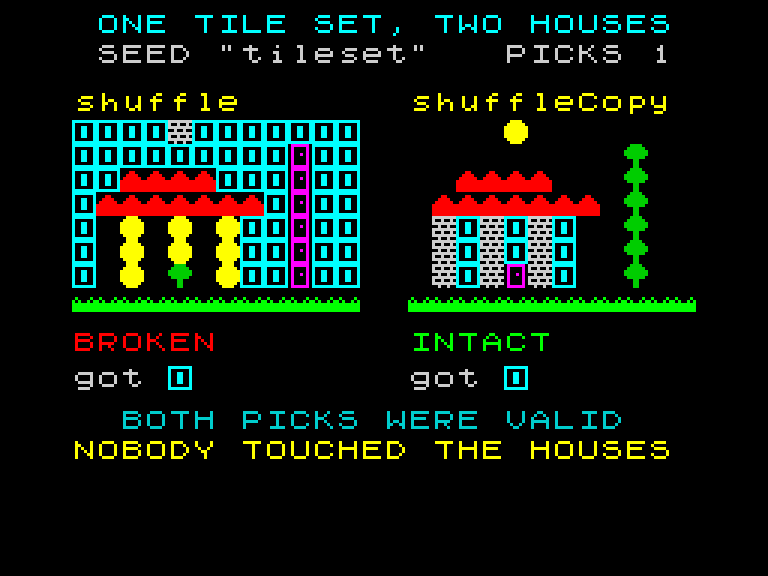

# shuffle vs shuffleCopy

Two identical houses. One press. One of them falls apart.



## What you are looking at

Both panels draw the **same house** from the **same tile set** with the **same seed**.
Each press asks for one random tile — the innocent one-liner every game has:

```js
const tile = rng.shuffle(TILES)[0]      // left panel
const tile = rng.shuffleCopy(TILES)[0]  // right panel
```

Both return a perfectly good tile. Press once and look at the `got` row: **both sides
picked the same one.** The randomness was never the problem.

Now look at the houses.

## Why the left one breaks

The scene does not store tiles. It stores **indices** into the tile set:

```js
const SCENE = ['000010000000', '002222000700', '034343400700', /* … */]
//                                ^ 3 means "wall", 4 means "window"
```

`shuffle` reorders the array you hand it. So the moment it is handed `TILES`, index 3
stops meaning *wall* and starts meaning whatever landed in slot 3. The house was never
edited — every index is exactly what it was. The **table underneath it** moved.

`shuffleCopy` shuffles a copy and hands that back. The tile set is untouched, on press
one and on press five hundred.

## Why this deserves an API and not a footnote

Nothing throws. Nothing logs. The left panel's pick was **valid** — it really is a
random tile from the set. The damage lands somewhere else entirely, in whichever code
reads that table next, which may be a different module written months apart.

And under a seeded RNG it gets worse: the corruption is **deterministic**. The same
seed wrecks the table the same way every run, so the bug reproduces perfectly and
looks like intended behaviour. A daily challenge that was supposed to be identical for
every player still *is* identical — just identically wrong.

## The other half: `readonly`

```ts
pick<T>(items: readonly T[]): T          // always accepted readonly
shuffle<T>(items: T[]): T[]              // needs a mutable array
shuffleCopy<T>(items: readonly T[]): T[] // accepts readonly, returns a fresh array
```

A content table declared the way content tables usually are —

```ts
export const PLAYLIST: readonly Song[] = [ /* … */ ]
```

— **cannot be passed to `shuffle` at all.** It does not compile. The workaround was
`[...PLAYLIST]`, written by hand, remembered every time. `shuffleCopy` moves that copy
out of your memory and into the type signature.

## Which one to reach for

Use **`shuffle`** when you created the array on that line and nobody else will ever see
it:

```js
const bag = rng.shuffle(Array.from({ length: n }, (_, i) => i)) // fresh, throwaway
```

Use **`shuffleCopy`** for anything you did not just build. It costs one array
allocation — nothing next to a content table that silently reorders itself.

Both draw from the same stream, so the same seed yields the same permutation either
way. Swapping one for the other never changes *which* shuffle you get, only *what gets
shuffled*.

## Controls

| Key | Does |
|-----|------|
| `SPACE` | pick a random tile |
| `R` | rebuild both houses |

Build first with `npm run build`, then serve the repository root and open
`examples/shuffle-copy/`.
